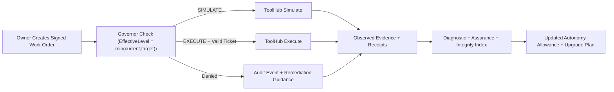

# Agent Maturity Compass (AMC)

`agent-maturity-compass` is a TypeScript CLI + SDK for tamper-evident maturity diagnostics of AI agents.

- Repo: `Agent Maturity Compass`
- npm: `agent-maturity-compass`
- CLI: `amc`
- Runtime: Node.js `>=20`

AMC uses a signed append-only evidence ledger, evidence-gated scoring (42 questions / 5 layers), owner-signed targets, and anti-cherry-picking windows.

## Install

```bash
npm i -g agent-maturity-compass
# or
npx agent-maturity-compass@latest setup --demo
```

## Getting Started In 60 Seconds

```bash
# 1) Install
npm i -g agent-maturity-compass

# 2) Deterministic setup (single workspace or host mode; use --demo for 2-minute local run)
amc setup --demo

# 3) Start local control plane
amc up

# 4) Open console URL printed by `amc up` and pair a LAN device if needed
# pairing hint is printed as: [PAIRING] http://<host>:<port>/console
```

Then run a one-liner adapter execution:

```bash
amc adapters run --agent <agentId> --adapter claude-cli -- <your command>
```

Then score and verify:

```bash
amc run --agent <agentId> --window 14d --target default
amc verify all --json
```

Open the dashboard/console URLs printed by `amc up`.

### CLI Discoverability Tips

```bash
# Top-level and grouped command help
amc --help
amc help adapters
amc help adapters run

# Equivalent direct path help
amc adapters run --help
```

If you mistype a command, AMC now prints closest command path suggestions to help you recover quickly.

Go-live references:
- [`docs/AMC_MASTER_REFERENCE.md`](docs/AMC_MASTER_REFERENCE.md)
- [`docs/SYSTEM_CAPABILITIES.md`](docs/SYSTEM_CAPABILITIES.md)
- [`docs/LAUNCH.md`](docs/LAUNCH.md)
- [`docs/OPERATIONS.md`](docs/OPERATIONS.md)
- [`docs/ARCHITECTURE_MAP.md`](docs/ARCHITECTURE_MAP.md)
- [`docs/MECHANIC_MODE.md`](docs/MECHANIC_MODE.md)

## Go-Live Gate

```bash
npm ci
npm test
npm run build
amc e2e smoke --mode local --json
amc verify all --json
```

## Deploy AMC Studio

Production deployment assets are included:
- Docker image (`Dockerfile`)
- Compose stacks (`deploy/compose`)
- Helm chart (`deploy/helm/amc`)

Quick examples:

```bash
# Docker compose
cd deploy/compose
cp .env.example .env
docker compose up -d --build

# Helm
helm lint deploy/helm/amc
helm template amc deploy/helm/amc
```

Deployment guides:
- [`docs/DEPLOYMENT.md`](docs/DEPLOYMENT.md)
- [`docs/OPERATIONS.md`](docs/OPERATIONS.md)
- [`docs/SECURITY_DEPLOYMENT.md`](docs/SECURITY_DEPLOYMENT.md)

## Verify Releases Offline

AMC ships a signed release bundle format (`.amcrelease`) that can be verified without network access.

```bash
amc release verify amc-1.2.3.amcrelease
```

Release/supply-chain docs:
- [`docs/RELEASING.md`](docs/RELEASING.md)
- [`docs/RELEASE_RUNBOOK.md`](docs/RELEASE_RUNBOOK.md)
- [`docs/MIGRATION_RUNBOOK.md`](docs/MIGRATION_RUNBOOK.md)
- [`docs/SUPPLY_CHAIN.md`](docs/SUPPLY_CHAIN.md)
- [`docs/HARDWARE_TRUST.md`](docs/HARDWARE_TRUST.md)
- [`docs/NOTARY.md`](docs/NOTARY.md)

Each release is treated as a renewed, verifiable compass checkpoint for continuous recurrence.

## Operational Hardening

AMC includes signed ops-policy controls for retention, encryption-at-rest, backups, maintenance, and runtime metrics.

```bash
# initialize + verify signed ops policy
amc ops init
amc ops verify

# retention lifecycle (archive + payload prune with hash-chain continuity)
amc retention run --dry-run
amc retention run
amc retention verify

# encrypted, signed backup lifecycle
amc backup create --out .amc/backups/latest.amcbackup
amc backup verify .amc/backups/latest.amcbackup
amc backup restore .amc/backups/latest.amcbackup --to /tmp/amc-restore

# operations maintenance and metrics
amc maintenance stats
amc maintenance vacuum
amc metrics status
```

Ops hardening docs:
- [`docs/OPS_HARDENING.md`](docs/OPS_HARDENING.md)
- [`docs/ENCRYPTION_AT_REST.md`](docs/ENCRYPTION_AT_REST.md)
- [`docs/BACKUPS.md`](docs/BACKUPS.md)
- [`docs/METRICS.md`](docs/METRICS.md)
- [`docs/ATTESTATION_EVIDENCE_PATHS.md`](docs/ATTESTATION_EVIDENCE_PATHS.md)
- [`docs/INCIDENT_RESPONSE_READINESS.md`](docs/INCIDENT_RESPONSE_READINESS.md)

Baseline incident-readiness check:

```bash
npm run check:incident-readiness
```

This is the reliability layer for continuous recurrence: AMC can keep running in real time while preserving verifiability and trust under long-lived operations.

## Advanced Anti-Cheat (Notary)

AMC supports a hardened signing boundary through a separate **AMC Notary** process. In `NOTARY` trust mode, critical signatures are produced outside Studio and enforced fail-closed when trust checks do not pass.

```bash
# initialize and run notary
amc notary init
amc notary start

# enable notary-backed trust
amc trust enable-notary \
  --base-url http://127.0.0.1:4343 \
  --pin /path/to/notary.pub \
  --require HARDWARE

# verify current trust posture + attestation
amc trust status
amc notary attest --out /tmp/current.amcattest
amc notary verify-attest /tmp/current.amcattest
```

Console trust view:
- `/console/trust`

This is the anti-cheat trust layer for risk assurance: signing is isolated from agent/runtime paths, key mismatch/downtime is surfaced loudly, and issuance paths fail closed until trust is restored.

## Adapters (SimpleClaw-style One-Liners)

`amc adapters run` is the fastest path for most real-world agent CLIs and bots. It:
- mints a short-lived lease automatically
- injects compatibility env vars (base URL + lease-as-api-key carrier)
- routes model traffic through AMC gateway/proxy
- captures signed evidence (`agent_process_started/stdout/stderr/exited`)
- redacts lease tokens from logs by default

Terminology coverage: AMC supports common teams terms including AI bots, AI agents, AI employees, clawbots, OpenClaw workflows, and SimpleClaw-style one-liner launches.

Provider route families supported by adapter profiles:
- `/openai`, `/anthropic`, `/gemini`, `/grok`, `/openrouter`, `/local`

Examples:

```bash
amc adapters run --agent <agentId> --adapter claude-cli -- <cmd...>
amc adapters run --agent <agentId> --adapter gemini-cli -- <cmd...>
amc adapters run --agent <agentId> --adapter openclaw-cli -- <cmd...>
amc adapters run --agent <agentId> --adapter generic-cli -- node my-agent.js
```

Compatibility note:
- AMC accepts leases via `x-amc-lease`, `Authorization: Bearer`, `x-api-key`, `x-goog-api-key`, and `api-key`.
- AMC still strips agent-provided provider credentials before upstream forwarding.
- Real provider secrets remain vault-only (zero-key agents).

## Connect Any Agent In 60 Seconds

This is the universal bridge flow for AI bots, AI agents, AI employees, clawbots, OpenClaw, and simpleclaw-style CLI agents.

```bash
# 1) Owner creates a one-time pairing code
amc pair create --agent-name "my-agent" --ttl-min 10

# 2) Agent machine redeems into a short-lived lease token
amc pair redeem AMC-XXXX-XXXX --out ./agent.token --bridge-url http://127.0.0.1:3212

# 3) Optional: write local bridge profile + connectivity check
amc connect --token-file ./agent.token --bridge-url http://127.0.0.1:3212

# 4) Wrap and run any local CLI agent with evidence capture
amc wrap --agent-token ./agent.token --provider auto -- node your-agent.js
```

Bridge docs and trust model:
- [`docs/BRIDGE.md`](docs/BRIDGE.md)
- [`docs/PAIRING.md`](docs/PAIRING.md)
- [`docs/CLI_WRAPPERS.md`](docs/CLI_WRAPPERS.md)
- [`docs/SDK.md`](docs/SDK.md)
- [`docs/EVIDENCE_TRUST.md`](docs/EVIDENCE_TRUST.md)

## Northstar Prompt Packs (Bridge-Enforced)

Northstar prompt packs provide one signed, deterministic guidance layer per agent across supported providers. Bridge enforces the pack system prompt, logs override attempts, and binds receipts to the pack hash.

```bash
# 1) initialize signed prompt policy
amc prompt init

# 2) build a signed + linted pack for an agent
amc prompt pack build --agent <agentId>

# 3) route model traffic through AMC Bridge endpoints
#    (OpenAI / Anthropic / Gemini / xAI / OpenRouter compat)

# 4) open console northstar page
# http://127.0.0.1:3212/console/northstar.html
```

Prompt-engine docs:
- [`docs/NORTHSTAR_PROMPTS.md`](docs/NORTHSTAR_PROMPTS.md)
- [`docs/BRIDGE_PROMPT_ENFORCEMENT.md`](docs/BRIDGE_PROMPT_ENFORCEMENT.md)
- [`docs/PROMPT_POLICY.md`](docs/PROMPT_POLICY.md)
- [`docs/ANTI_HALLUCINATION.md`](docs/ANTI_HALLUCINATION.md)

## Compass Console (60-Second Flow)

```bash
# 1) Start Studio
amc up

# 2) Open the interactive owner console
# http://127.0.0.1:3212/console

# 3) Preview equalizer changes before signing
amc whatif equalizer --agent <agentId> --set AMC-1.1=3 --set AMC-3.3.1=5

# 4) Approve execution intents safely (single-shot signed approvals)
amc approvals list --agent <agentId> --status pending
amc approvals approve --agent <agentId> <approvalId> --mode execute --reason "approved by owner"

# 5) Create a signed, privacy-safe bench artifact
amc bench init
amc bench create --scope workspace --out .amc/bench/exports/workspace/workspace/latest.amcbench
```

## Team-Ready: Multi-User + Dual Control + Device-First Console

Compass Console now supports:
- signed multi-user RBAC (`OWNER`, `AUDITOR`, `APPROVER`, `OPERATOR`, `VIEWER`, `AGENT`)
- username/password login with HttpOnly session cookie (`amc_session`)
- dual-control approval quorum for high-impact execution classes
- LAN pairing gate for mobile/tablet access without exposing admin tokens
- installable PWA shell with offline-safe read-only snapshot

Quick ops:

```bash
amc user init
amc user add --username alice --role APPROVER
amc studio lan enable --bind 0.0.0.0 --port 3212 --cidr 192.168.1.0/24
amc pair create --ttl 10m
```

## Enterprise SSO + SCIM

AMC supports host-level OIDC, SAML, and SCIM provisioning for multi-workspace deployments.

```bash
# 1) Initialize signed identity config
amc identity init --host-dir /path/to/amc-host

# 2) Add OIDC provider (example)
amc identity provider add oidc \
  --host-dir /path/to/amc-host \
  --id okta \
  --issuer https://your-issuer.example.com \
  --client-id your-client-id \
  --client-secret-file /secure/path/client-secret.txt \
  --redirect-uri https://amc.example.com/host/api/auth/oidc/okta/callback

# 3) Add signed group-to-role mapping
amc identity mapping add \
  --host-dir /path/to/amc-host \
  --group amc-ws-default-owner \
  --workspace default \
  --roles OWNER,AUDITOR

# 4) Create SCIM token (shown once)
amc scim token create --host-dir /path/to/amc-host --name okta-scim --out /secure/path/scim-token.txt
```

Open `/host/console`, choose SSO provider, and sign in.

Identity docs:
- [`docs/IDENTITY.md`](docs/IDENTITY.md)
- [`docs/SSO_OIDC.md`](docs/SSO_OIDC.md)
- [`docs/SSO_SAML.md`](docs/SSO_SAML.md)
- [`docs/SCIM.md`](docs/SCIM.md)

## Comparative Scorecards In Realtime (Team/Function/Process/Enterprise/Ecosystem)

ORG Compass provides signed comparative scorecards with trust-weighted, integrity-aware aggregation and live Studio SSE updates.

```bash
# Define org graph + assignments
amc org init
amc org add node --type TEAM --id team-platform --name "Platform Team" --parent enterprise
amc org assign --agent default --node team-platform

# Compute signed scorecards
amc org score --window 14d
amc org report --node team-platform --out .amc/reports/team-platform.md
amc org compare --node-a team-platform --node-b enterprise --out .amc/reports/team-vs-enterprise.md
```

Console pages:
- `/console/org` (tree + node detail + ecosystem rollup)
- `/console/compare` (node vs node deltas)
- `/console/systemic` (enterprise systemic risk map)
- `/console/commitments-org` (group-level E/O/C plans)

Aggregation is explicitly honest:
- trust-tier multipliers (`OBSERVED_HARDENED` to `SELF_REPORTED`)
- integrity weighting
- robust weighted median + trimmed mean
- evidence-gap caps when OBSERVED coverage/correlation are weak

## Ecosystem Comparative View (Bench Registry)

Use the new bench registry pipeline for verifiable, privacy-safe ecosystem comparisons:

```bash
# workspace policy + artifact
amc bench init
amc bench create --scope workspace --out .amc/bench/exports/workspace/workspace/latest.amcbench
amc bench verify .amc/bench/exports/workspace/workspace/latest.amcbench

# registry (local dir or static hosting root)
amc bench registry init --dir ./bench-registry --id official --name "Official Bench Registry"
amc bench registry publish --dir ./bench-registry --file .amc/bench/exports/workspace/workspace/latest.amcbench --registry-key ./bench-registry/registry.key
amc bench registry serve --dir ./bench-registry --port 9988

# workspace import + compare
amc bench import --registry-id official --bench <benchId>@latest
amc bench compare --scope workspace --id workspace --against imported
```

This keeps the “compass over maps” model intact:
- benchmarks are signed compass checkpoints, not promises
- comparisons are deterministic and evidence-gated
- warnings are explicit when imported/local trust evidence is weak
- no raw evidence, prompts, or secrets are shared

Benchmark docs:
- [`docs/BENCHMARKS.md`](docs/BENCHMARKS.md)
- [`docs/BENCH_REGISTRY.md`](docs/BENCH_REGISTRY.md)
- [`docs/ECOSYSTEM_COMPARATIVE_VIEW.md`](docs/ECOSYSTEM_COMPARATIVE_VIEW.md)

## Forecasting & Planning

AMC includes deterministic, evidence-gated forecasting and advisory generation for workspace, node, and agent scopes.

```bash
# initialize signed forecast policy
amc forecast init

# generate latest forecast snapshot
amc forecast refresh --scope workspace

# inspect advisories
amc advisory list --scope workspace
amc advisory show <advisoryId>
amc advisory ack <advisoryId> --note "reviewed"
```

Console pages:
- `/console/forecast`
- `/console/forecastAgent`
- `/console/forecastNode`
- `/console/advisories`
- host mode: `/host/console/portfolioForecast`

Principles enforced in code:
- continuous recurrence: signed scheduler refreshes on cadence and key events
- unified clarity: single view of maturity, integrity, risk indices, value dimensions, and ETA
- compass over maps: forecasts are directional evidence, not brittle promises
- anti-hallucination: when evidence gates fail, AMC outputs `INSUFFICIENT_EVIDENCE` with explicit reasons and no numeric projection claims

Forecasting docs:
- [`docs/FORECASTING.md`](docs/FORECASTING.md)
- [`docs/PREDICTIVE_MAINTENANCE.md`](docs/PREDICTIVE_MAINTENANCE.md)
- [`docs/CONTINUOUS_RECURRENCE.md`](docs/CONTINUOUS_RECURRENCE.md)
- [`docs/MODEL_GOVERNANCE.md`](docs/MODEL_GOVERNANCE.md)

## Value Realization (5 Value Dimensions)

AMC includes a signed, deterministic Value Realization Engine for continuous recurrence of business impact evidence:

- Emotional Value
- Functional Value
- Economic Value
- Brand Value
- Lifetime Value

Quickstart:

```bash
# initialize signed value policy + default contract
amc value init

# create an agent-specific contract
amc value contract init --scope agent --id <agentId> --type code-agent

# run agents via Bridge/ToolHub to generate OBSERVED value signals
# (optional) ingest numeric attested KPIs
amc value ingest --file ./value-webhook.json --attested

# generate deterministic signed snapshot/report
amc value snapshot --scope agent --id <agentId> --window-days 30
amc value report --scope agent --id <agentId> --window-days 30
```

Console pages:

- `/console/value`
- `/console/valueAgent`
- `/console/valueKpis`

Design principles:

- continuous recurrence: scheduler refreshes value checkpoints on cadence and key governance events
- unified clarity: value dimensions, economic significance, and evidence gates are visible in one view
- compass over maps: value guidance is directional and evidence-bound, not a one-time promise
- honest-by-design: if evidence gates fail, AMC reports `INSUFFICIENT_EVIDENCE` and withholds strong numeric claims

Value docs:

- [`docs/VALUE_REALIZATION.md`](docs/VALUE_REALIZATION.md)
- [`docs/VALUE_CONTRACTS.md`](docs/VALUE_CONTRACTS.md)
- [`docs/ECONOMIC_SIGNIFICANCE.md`](docs/ECONOMIC_SIGNIFICANCE.md)
- [`docs/VALUE_INGESTION.md`](docs/VALUE_INGESTION.md)

## Compass Core (Canon + Context Graph)

AMC now includes a signed Compass Canon and deterministic Context Graph (CGX) that keep diagnostics stable, evidence-bound, and recurrence-ready.

```bash
# initialize and verify canonical compass content
amc canon init
amc canon verify

# initialize and build signed context graph artifacts
amc cgx init
amc cgx build --scope workspace
amc cgx build --scope agent --id <agentId>

# render contextualized 42-question view for an agent
amc diagnostic render --agent <agentId> --format md

# lease-auth self-run (agent triggers run, AMC computes scores from evidence)
amc agent diagnose --token-file ./agent.token --studio http://127.0.0.1:3212
```

Key principles enforced in this flow:
- continuous recurrence: signed canon/policy/graph artifacts refresh on schedule and on key governance events
- realtime unified clarity: canonical 5-dimension/42-question structure is consistent while contextual wording adapts per agent role
- compass over maps: CGX + diagnostics provide directional, evidence-bound guidance, not brittle static plans
- honest uncertainty: missing observed/attested evidence yields `UNKNOWN` semantics and capped scores

Docs:
- [`docs/CANON.md`](docs/CANON.md)
- [`docs/CONTEXT_GRAPH.md`](docs/CONTEXT_GRAPH.md)
- [`docs/DIAGNOSTIC_BANK.md`](docs/DIAGNOSTIC_BANK.md)
- [`docs/TRUTHGUARD.md`](docs/TRUTHGUARD.md)

## Agent Passport (Shareable Maturity Credential)

Agent Passport is AMC's signed, privacy-safe maturity credential for sharing trust posture without exposing prompts, raw logs, or PII.

Quickstart:

```bash
# 1) initialize signed passport policy
amc passport init

# 2) create a passport artifact for an agent
amc passport create --scope agent --id <agentId> --out ./agent.amcpass

# 3) verify offline
amc passport verify ./agent.amcpass

# 4) open console pages
# /console/passport
# /console/standard
```

Open Compass Standard publishes signed schema bundles for ecosystem tooling validation:

```bash
amc standard generate
amc standard verify
amc standard validate --schema amcpass --file ./agent.amcpass
```

This keeps recurrence and comparative workflows honest:
- continuous recurrence: passports regenerate as signed checkpoints
- unified clarity: maturity, risk assurance, and value context in one credential
- compass over maps: share directional trust posture, not brittle promises

Docs:
- [`docs/AGENT_PASSPORT.md`](docs/AGENT_PASSPORT.md)
- [`docs/OPEN_STANDARD.md`](docs/OPEN_STANDARD.md)

## Transparency Log: Offline-Verifiable Issuance History

AMC appends signed, hash-chained transparency entries for core issuance/update artifacts.

```bash
amc transparency init
amc transparency tail --n 50
amc transparency verify
amc transparency export --out transparency.amctlog
amc transparency verify-bundle transparency.amctlog
```

## Ecosystem-Ready Federation + Compliance

AMC can now generate evidence-linked compliance coverage, Merkle inclusion proofs, and privacy-safe federation packages for offline cross-org sync.

```bash
# Compliance mapping and reporting
amc compliance init
amc compliance verify
amc compliance report --framework SOC2 --window 14d --out .amc/reports/compliance-soc2.md
amc compliance fleet --framework SOC2 --window 30d --out .amc/reports/compliance-fleet.json

# Merkle transparency root/proof workflow
amc transparency merkle rebuild
amc transparency merkle root
amc transparency merkle prove --entry-hash <entryHash> --out .amc/transparency/proofs/<entryHash>.amcproof
amc transparency merkle verify-proof .amc/transparency/proofs/<entryHash>.amcproof

# Federation sync (offline package)
amc federate init --org \"My Org\"
amc federate peer add --peerId partner --name \"Partner\" --pubkey ./partner.pub
amc federate export --out .amc/federation/outbox/latest.amcfed
amc federate import .amc/federation/outbox/latest.amcfed
```

## No-Hallucination Compliance

AMC compliance output is constrained to deterministic evidence checks only. Categories are marked `SATISFIED` only when requirements are met by verified events/assurance data; otherwise they remain `PARTIAL`, `MISSING`, or `UNKNOWN`. AMC does not infer legal attestations.

## Policy Packs: Golden Configs By Archetype + Risk

Policy packs apply signed, deterministic governance baselines and equalizer adjustments.

```bash
amc policy pack list
amc policy pack describe code-agent.high
amc policy pack diff --agent <agentId> code-agent.high
amc policy pack apply --agent <agentId> code-agent.high
```

## Ecosystem Extensions (Signed Plugin Marketplace)

AMC supports a content-only plugin marketplace with offline verification and dual-control install flows.

```bash
# publisher side
amc plugin keygen --out-dir ./keys
amc plugin pack --in ./plugin-src --key ./keys/publisher.key --out ./dist/my-plugin.amcplug

# registry side
amc plugin registry init --dir ./registry
amc plugin registry publish --dir ./registry --file ./dist/my-plugin.amcplug --registry-key ./registry/registry.key
amc plugin registry serve --dir ./registry --port 9876

# workspace side
amc plugin init
amc plugin registries-apply --file ./registries.yaml
amc plugin search --registry http://127.0.0.1:9876
amc plugin install --registry official amc.plugin.example@1.0.0
amc plugin execute --approval-request <approvalRequestId>
```

Console plugin management page:
- `/console/plugins`

Docs:
- [`docs/PLUGINS.md`](docs/PLUGINS.md)
- [`docs/REGISTRY.md`](docs/REGISTRY.md)
- [`docs/PLUGIN_SUPPLY_CHAIN.md`](docs/PLUGIN_SUPPLY_CHAIN.md)

## Core Workflow

1. Setup and health checks:

```bash
amc init
amc doctor
```

2. Capture evidence (choose one or more):

```bash
amc wrap claude -- <args...>
amc wrap gemini -- <args...>
amc wrap openclaw -- <args...>
amc wrap any -- <cmd...>

amc gateway init --provider "OpenAI"
amc gateway start --config .amc/gateway.yaml
amc supervise --agent <agentId> --route http://127.0.0.1:3210/openai -- <cmd...>

amc sandbox run --agent <agentId> --route http://127.0.0.1:3210/openai -- <cmd...>
```

3. Score + verify:

```bash
amc run --agent <agentId> --window 14d --target default --output .amc/reports/latest.md
amc verify
```

## Fleet Mode

Manage multiple agents in one workspace:

```bash
amc fleet init
amc agent add
amc agent list
amc agent use <agentId>
amc fleet report --window 30d --output .amc/reports/fleet.md
```

## Mechanic Workbench (Upgrade to Excellence)

Mechanic Workbench provides a signed equalizer (`0..5` across all 42 questions), deterministic upgrade planning, and what-if simulation. It is designed for continuous recurrence: plan, execute with approvals, checkpoint, and re-measure. The workflow is structured around 4Cs (Concept, Culture, Capabilities, Configuration) and follows a compass-over-maps approach: adapt continuously using evidence rather than fixed one-time plans. The UI/CLI keeps unified clarity by showing measured vs desired maturity, 5 strategy-failure risks, and 5 value dimensions side by side.

```bash
amc mechanic targets init --scope workspace
amc mechanic targets apply --file .amc/mechanic/targets.yaml --reason "Set quarterly desired state"

amc mechanic plan create --scope workspace --from measured --to targets
amc mechanic plan request-approval <planId> --reason "Execute approved upgrade cycle"
amc mechanic plan execute <planId>

amc mechanic simulate <planId>
```

Open the console workbench at `/console/mechanic.html` (or `/w/<workspaceId>/console/mechanic.html` in host mode).

Docs:
- `docs/MECHANIC_WORKBENCH.md`
- `docs/EQUALIZER_TARGETS.md`
- `docs/UPGRADE_AUTOPILOT.md`

## From Measurement To Enforcement

AMC enforces maturity-aligned autonomy with signed policies, work orders, and execute tickets.



Key commands:

```bash
amc policy action init
amc governor check --agent <agentId> --action DEPLOY --risk high --mode execute
amc tools init
amc workorder create --agent <agentId> --title \"Release\" --risk high --mode execute --allow DEPLOY
amc ticket issue --agent <agentId> --workorder <workOrderId> --action DEPLOY --tool git.push --ttl 15m
```

## Release Gates + Bundles

Export portable evidence and enforce release thresholds in CI:

```bash
amc bundle export --agent <agentId> --run <runId> --out .amc/agents/<agentId>/bundles/latest.amcbundle
amc bundle verify .amc/agents/<agentId>/bundles/latest.amcbundle
amc gate --bundle .amc/agents/<agentId>/bundles/latest.amcbundle --policy .amc/agents/<agentId>/gatePolicy.json

amc ci init --agent <agentId>
amc ci print --agent <agentId>
```

## Archetypes

Built-in role packs with signed target regeneration and audit trail:

```bash
amc archetype list
amc archetype describe code-agent
amc archetype apply --agent <agentId> code-agent
```

## Policy Export + Badge

```bash
amc export policy --agent <agentId> --target default --out ./policy-pack
amc export badge --agent <agentId> --run <runId> --out ./badge.svg
```

Policy export includes framework-agnostic files plus JS drop-in helpers (`fetch-wrapper`, `logger-helper`).

## Assurance Lab

Run deterministic defensive assurance packs with signed evidence and fail-closed gates:

```bash
amc assurance init
amc assurance verify-policy
amc assurance run --scope workspace --pack all
amc assurance runs
amc assurance cert issue --run <runId>
amc assurance cert verify .amc/assurance/certificates/latest.amccert
```

Packs included:
- `injection`
- `exfiltration`
- `toolMisuse`
- `truthfulness`
- `sandboxBoundary`
- `notaryAttestation`

Continuous recurrence controls:

```bash
amc assurance scheduler status
amc assurance scheduler run-now
```

Controlled risk-run mode (dual-control, time-limited):

```bash
amc assurance waiver request --hours 24 --reason "temporary continuity while remediating"
amc assurance waiver status
```

This is AMC's risk-assurance loop across the digital duality boundary: deterministic checks, signed artifacts/proofs, and readiness gating when posture drops below policy.

## Audit Binder (Auditor-Ready)

Generate deterministic, signed audit binders with compliance-map control results and proof bindings to transparency + Merkle roots:

```bash
amc audit init
amc audit binder create --scope workspace --out ./workspace.amcaudit
amc audit binder verify ./workspace.amcaudit
```

For controlled auditor disclosure:

```bash
amc audit request create --scope workspace --items control:ACCESS_CONTROL.SSO_SCIM
amc audit request approve <requestId> --reason "approved for review"
amc audit request fulfill <requestId> --out ./requested.amcaudit
```

Open Console pages:

- `/console/audit.html`
- `/console/auditBinder.html`
- `/console/auditRequests.html`

This keeps evidence sharing privacy-safe and tamper-proof while supporting continuous recurrence, unified clarity, and compass-over-maps operations across governance and risk assurance.

## Measure Maturity + Prove Value

AMC now includes an outcomes/value layer on top of the 5-layer maturity compass. Value claims are evidence-gated, signed, and trust-tiered exactly like diagnostic claims.

```bash
# signed value contract
amc outcomes init --agent <agentId>
amc outcomes verify --agent <agentId>

# value reports
amc outcomes report --agent <agentId> --window 14d --out .amc/agents/<agentId>/outcomes/reports/latest.json
amc outcomes report fleet --window 30d --out .amc/reports/fleet-outcomes.md
amc outcomes diff reportA.json reportB.json
```

Outcome reports include:
- `ValueScore` and per-category subscores: Emotional, Functional, Economic, Brand, Lifetime
- `EconomicSignificanceIndex` and `ValueRegressionRisk`
- trust coverage (`OBSERVED` / `ATTESTED` / `SELF_REPORTED`)
- evidence references and explicit non-claims

## Experiments Before Release

Casebooks and experiments provide deterministic baseline-vs-candidate validation before production rollout.

```bash
# signed casebook
amc casebook init --agent <agentId> --casebook default
amc casebook add --agent <agentId> --casebook default --from-workorder <workOrderId>
amc casebook verify --agent <agentId> --casebook default

# experiment lifecycle
amc experiment create --agent <agentId> --name \"model-upgrade\" --casebook default
amc experiment set-baseline --agent <agentId> --experiment <expId> --config current
amc experiment set-candidate --agent <agentId> --experiment <expId> --candidate-file ./candidate.yaml
amc experiment run --agent <agentId> --experiment <expId> --mode sandbox
amc experiment analyze --agent <agentId> --experiment <expId> --out .amc/agents/<agentId>/experiments/<expId>/latest.md
amc experiment gate --agent <agentId> --experiment <expId> --policy .amc/agents/<agentId>/experimentGate.json
```

CI gates can combine maturity + assurance + value:
- `minValueScore`
- `minEconomicSignificanceIndex`
- `denyIfValueRegression`
- optional experiment pass criteria (`requireExperimentPass`)

## Receipts + Correlation

AMC gateway mints monitor-signed receipts for `llm_request` / `llm_response` events and injects them back to clients (`x-amc-receipt`).

`amc run` now performs deterministic trace correlation:
- verifies receipt signatures,
- verifies receipt `event_hash` exists in ledger,
- verifies receipt `body_sha256` matches evidence payload hash,
- emits `TRACE_*` audits and applies score caps when mismatches occur.

## Runtime Embed SDK

For Node agents, use built-in runtime helpers:

```ts
import { wrapFetch, logTrace, validateTruthProtocol } from "agent-maturity-compass";

const fetchWithAmc = wrapFetch(fetch, {
  agentId: "salesbot",
  gatewayBaseUrl: "http://127.0.0.1:3210/openai",
  forceBaseUrl: true
});

const response = await fetchWithAmc("https://api.openai.com/v1/chat/completions", {
  method: "POST",
  body: JSON.stringify({ model: "gpt-4o-mini", messages: [{ role: "user", content: "hi" }] })
});
```

## Device-First Dashboard + E/O/C

```bash
amc dashboard build --agent <agentId> --out .amc/agents/<agentId>/dashboard
amc dashboard serve --agent <agentId> --port 4173

amc learn --agent <agentId> --question AMC-2.5
amc own --agent <agentId> --target default
amc commit --agent <agentId> --target default --days 14 --out .amc/agents/<agentId>/commitments/plan.md
```

## AMC Studio + Vault + Modes

```bash
amc up
amc status
amc logs
amc down

amc vault status
amc vault unlock
amc vault lock
amc vault rotate-keys

amc mode owner
amc mode agent
amc fix-signatures
```

`amc up` starts gateway, proxy, dashboard, and local studio API on localhost.

## Keyless Agents + Leased Access

AMC keeps provider credentials in the Studio vault and requires short-lived signed leases for gateway/proxy/toolhub access.

```bash
# issue scoped lease
amc lease issue --agent <agentId> --ttl 60m --scopes gateway:llm,toolhub:intent,toolhub:execute --routes /openai --models "gpt-*" --rpm 60 --tpm 200000

# verify and revoke
amc lease verify <leaseToken>
amc lease revoke <leaseId>
```

`amc connect` prints `AMC_LEASE` export guidance and dummy provider keys (`amc_dummy`) so agent processes never receive real provider secrets.

## Budgets + Drift Freeze

Budgets enforce LLM/tool usage ceilings; drift rules can freeze EXECUTE for risky action classes until recovery.

```bash
amc budgets init
amc budgets verify
amc budgets status --agent <agentId>
amc budgets reset --agent <agentId> --day 2026-02-11

amc alerts init
amc alerts verify
amc alerts test

amc drift check --agent <agentId> --against previous
amc drift report --agent <agentId> --out .amc/agents/<agentId>/reports/drift.md
amc freeze status --agent <agentId>
amc freeze lift --agent <agentId> --incident <incidentId>
```

## Continuous Loop

```bash
amc loop init
amc loop plan --agent <agentId> --cadence weekly
amc loop run --agent <agentId> --days 14
amc loop schedule --agent <agentId> --os cron --cadence weekly
amc snapshot --agent <agentId> --out .amc/agents/<agentId>/reports/snapshots/latest.md
```

## Certification + Indices

Issue and verify offline certificates:

```bash
amc certify --agent <agentId> --run <runId> --policy .amc/agents/<agentId>/gatePolicy.json --out ./agent.amccert
amc cert verify ./agent.amccert
amc cert inspect ./agent.amccert
amc cert revoke --reason "superseded" --cert ./agent.amccert --out ./agent.amcrevoke
amc cert verify-revocation ./agent.amcrevoke
```

Compute failure-risk indices:

```bash
amc indices --agent <agentId> --run <runId> --out ./indices.md
amc indices fleet --window 30d --out .amc/reports/fleet-indices.md
```

## Release BOM

Generate a signed Maturity Bill of Materials (BOM) for release artifacts and offline verification:

```bash
amc bom generate --agent <agentId> --run <runId> --out ./amc-bom.json
amc bom sign --in ./amc-bom.json --out ./amc-bom.json.sig
amc bom verify --in ./amc-bom.json --sig ./amc-bom.json.sig --pubkey .amc/keys/auditor_ed25519.pub
```

## Trust Model

- Untrusted: evaluated agent (claims only)
- Trusted: AMC monitor/gateway (evidence writer)
- Trusted: owner/auditor (target/run/config signatures)

If key isolation is not real, runs are marked `INVALID`.

## Commands

- `amc init`
- `amc doctor`
- `amc setup`
- `amc up|down|status|logs`
- `amc verify all`
- `amc quickstart` (legacy shortcut)
- `amc wrap <claude|gemini|openclaw|any> -- <args...>`
- `amc supervise --route <gatewayRoute> -- <cmd...>`
- `amc sandbox run --agent <agentId> -- <cmd...>`
- `amc monitor --stdin --runtime <name>`
- `amc gateway init`
- `amc gateway start`
- `amc gateway status`
- `amc gateway verify-config`
- `amc gateway bind-agent --agent <agentId> --route <prefix>`
- `amc policy action init|verify`
- `amc governor check|explain|report`
- `amc tools init|verify|list`
- `amc workorder create|list|show|verify|expire`
- `amc ticket issue|verify`
- `amc fleet init`
- `amc fleet report`
- `amc agent add|list|remove|use`
- `amc provider list|add`
- `amc ingest`
- `amc attest`
- `amc run`
- `amc report`
- `amc history`
- `amc compare`
- `amc verify`
- `amc target set|verify|diff`
- `amc tune`
- `amc upgrade`
- `amc guard`
- `amc bundle export|verify|inspect|diff`
- `amc gate`
- `amc ci init|print`
- `amc archetype list|describe|apply`
- `amc export policy|badge`
- `amc assurance init|verify-policy|policy print|policy apply|run|runs|show|cert issue|cert verify|scheduler status|scheduler run-now|scheduler enable|scheduler disable|waiver request|waiver status|waiver revoke`
- `amc outcomes init|verify|report|diff|attest`
- `amc casebook init|add|list|verify`
- `amc experiment create|set-baseline|set-candidate|run|analyze|gate|list`
- `amc certify`
- `amc cert verify|inspect|revoke|verify-revocation`
- `amc indices`
- `amc indices fleet`
- `amc dashboard build|serve`
- `amc learn`
- `amc own`
- `amc commit`
- `amc up|down|status|logs`
- `amc studio ping`
- `amc connect`
- `amc prompt init|verify|policy print|policy apply|status|pack build|pack verify|pack show|pack diff|scheduler status|scheduler run-now|scheduler enable|scheduler disable`
- `amc user init|add|list|revoke|role set|verify`
- `amc pair create`
- `amc studio lan enable|disable`
- `amc transparency init|verify|tail|export|verify-bundle`
- `amc transparency merkle rebuild|root|prove|verify-proof`
- `amc compliance init|verify|report|fleet|diff`
- `amc federate init|verify|peer add|peer list|export|import|verify-bundle`
- `amc integrations init|verify|status|test|dispatch`
- `amc policy pack list|describe|diff|apply`
- `amc lease issue|verify|revoke`
- `amc budgets init|verify|status|reset`
- `amc alerts init|verify|test`
- `amc drift check|report`
- `amc freeze status|lift`
- `amc bom generate|sign|verify`
- `amc vault init|unlock|lock|status|rotate-keys`
- `amc mode owner|agent`
- `amc loop init|run|plan|schedule`
- `amc snapshot`
- `amc fix-signatures`

## Docs

- `docs/RUNTIMES.md`
- `docs/PROVIDERS.md`
- `docs/ECOSYSTEM.md`
- `docs/NORTHSTAR_PROMPTS.md`
- `docs/BRIDGE_PROMPT_ENFORCEMENT.md`
- `docs/PROMPT_POLICY.md`
- `docs/ANTI_HALLUCINATION.md`
- `docs/FLEET.md`
- `docs/SANDBOX.md`
- `docs/MECHANIC_MODE.md`
- `docs/BUNDLES.md`
- `docs/CI.md`
- `docs/ARCHETYPES.md`
- `docs/POLICY_EXPORT.md`
- `docs/ASSURANCE_LAB.md`
- `docs/CERTIFICATION.md`
- `docs/RECEIPTS.md`
- `docs/RUNTIME_SDK.md`
- `docs/DASHBOARD.md`
- `docs/STUDIO.md`
- `docs/VAULT.md`
- `docs/CONNECT.md`
- `docs/MODES.md`
- `docs/LOOP.md`
- `docs/GOVERNOR.md`
- `docs/TOOLHUB.md`
- `docs/WORK_ORDERS.md`
- `docs/TICKETS.md`
- `docs/LEASES.md`
- `docs/ZERO_KEYS.md`
- `docs/BUDGETS.md`
- `docs/DRIFT_ALERTS.md`
- `docs/BOM.md`
- `docs/RBAC.md`
- `docs/DUAL_CONTROL_APPROVALS.md`
- `docs/PAIRING_LAN_PWA.md`
- `docs/TRANSPARENCY.md`
- `docs/TRANSPARENCY_MERKLE.md`
- `docs/COMPLIANCE.md`
- `docs/FEDERATION.md`
- `docs/INTEGRATIONS.md`
- `docs/OUTCOMES.md`
- `docs/CASEBOOKS.md`
- `docs/EXPERIMENTS.md`
- `docs/VALUE_GATES.md`
- `docs/POLICY_PACKS.md`
- `SECURITY.md`
